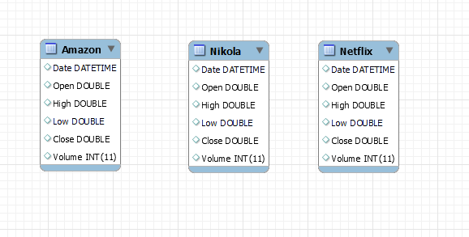

# Selective Stock Market Price Spanning COVID-19 Global Pandemic Predictions vs. Actuality 

## Table of Contents 
* [Overview](#overview)
* [Purpose](#purpose)
* [Technologies](#technologies)
* [Data](#data)
* [Models](#models)
* [Visualization](#visualization) 
* [Challenges](#challenges)
* [Summary](#summary)
* [Team Members](#team-members)

## Overview 
In this project we created predictive models to predict the 'bounce-back' of stock price for Amazon, Netfix and Nikola stock prices.  We compared the predictive models to the actual data for the same time period  

## Purpose
The purpose of our study is to:
* Extract, clean and pre-process data for models. 
* Build multiple machine learning models to predict selective stock market stocks spanning COVID-19 global pandemic and predict the 'bounce back' of the stock vs. actual prefromance of the selective stocks. 
* Compare each of the machine learning predictive models to the actual performance of the selected stocks. 
*  
* Use a Tableau HTML, to visualize models' prediction.

## Technologies 
* Python & Pandas
* Jupyter Notebook 
* Visual Studio
* MySql Database 
* xGBoost 

## Data
### Data Source

Three stocks specific stocks were chosen - Amazon, Netflix and Nikola.  All 3 stocks are listed on the NASDAX Stock exchange.  The data was gathered from Yahoo Finance:

* [Amazon](https://ca.finance.yahoo.com/quote/AMZN?p=AMZN&.tsrc=fin-srch)
* [Netflix](https://ca.finance.yahoo.com/quote/NFLX?p=NFLX&.tsrc=fin-srch)
* [Nikola](https://ca.finance.yahoo.com/quote/NKLA?p=NKLA&.tsrc=fin-srch)

### Data Cleaning 
The data was downloaded from the above links as .csv files.  These .csv files were imported into a MySQL Database. 

 
The data for each stock was then extracted and converted into a panda dataframe.
 
 

Fig 1 - Amazon
 
 

Fig 2 - Netflix
 
 

 Fig 3 - Nikola
 
 

## Models 
The models that were we used:

## Visualization
To visualise our data and predictions, we used the following:

* Matplot
* Tableau HTML Dashbaord 
* After Effects
* Premiere Pro

## Challenges
The challenges that we expereinced were:

## Summary 
In Summary

## Team Members
* <a href="https://github.com/dadario10"> Dario Micucci</a>
* <a href="https://github.com/bchaudang"> Brett Chau-dang </a>
* <a href="https://github.com/JP-Butler"> Justin Butler </a>
* <a href="https://github.com/RP8844)"> Rebeca Perez </a>
* <a href="https://github.com/rbrennan55"> Ron Brennan </a>

-30-
