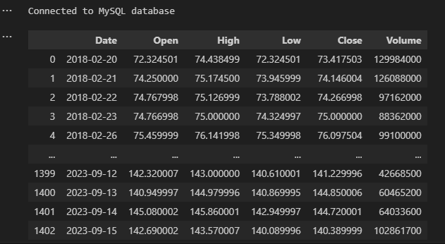

# Selective Stock Market Price Spanning COVID-19 Global Pandemic Predictions vs. Actuality 

## Table of Contents 
* [Overview](#overview)
* [Purpose](#purpose)
* [Technologies](#technologies)
* [Data](#data)
* [Models](#models)
* [Visualization](#visualization) 
* [Challenges](#challenges)
* [Summary](#summary)
* [Resources](#resources)
* [Team Members](#team-members)

## Overview 
In this project we created predictive models to predict the 'bounce-back' of stock price for Amazon, Netfix and Nikola stock prices.  We compared the predictive models to the actual data for the same time period  

## Purpose
The purpose of our study is to:
* Extract, clean and pre-process data for models. 
* Build multiple machine learning models to predict selective stock market stocks spanning COVID-19 global pandemic and predict the 'bounce back' of the stock vs. actual prefromance of the selective stocks. 
* Compare each of the machine learning predictive models to the actual performance of the selected stocks. 
* Use a Tableau HTML, to visualize models' prediction.

## Technologies 
* Python & Pandas
* Jupyter Notebook 
* Visual Studio
* MySql Database 
* xGBoost 

## Data
### Data Source

Three stocks were chosen; Amazon, Netflix and Nikola.  All three stocks are listed on the NASDAX Stock exchange.  The data was gathered from Yahoo Finance:

* [Amazon](https://ca.finance.yahoo.com/quote/AMZN?p=AMZN&.tsrc=fin-srch)
* [Netflix](https://ca.finance.yahoo.com/quote/NFLX?p=NFLX&.tsrc=fin-srch)
* [Nikola](https://ca.finance.yahoo.com/quote/NKLA?p=NKLA&.tsrc=fin-srch)

### Data Cleaning 
The data was downloaded from the above links as .csv files.  These .csv files were imported into a MySQL Database. 

 
The data for each stock was then extracted and converted into a panda dataframe.
 
 

 
Fig 1 - Amazon Dataframe
 
 

 
Fig 2 - Netflix Dataframe
 
 

 
Fig 3 - Nikola Dataframe
 
 

## Models 
The models that were we used:
* Arima
* XGBoost
* Artificial Neural Network for Regression

## Visualization
To visualise our data and predictions, we used the following:

* [Tableau Stock Visualizations Project 4](https://public.tableau.com/app/profile/dario.micucci/viz/StockVisualizationsProject4/VolumeDashboard?publish=yes)
* Matplot

## Challenges
The challenges that we expereinced were:

* Model selections
* Complexity and shape of the data
* Limited experience level of Models
* More advanced engineered features required

## Summary 
The question our team set out to answer was the continued impact of COVID-19 on stock market performance.

**Amazon:** The stocks took a steady rise during and following COVID. After a market correction, Amazon has continued increasing.

**Netflix:** There was a positive linear correlation to the Netflix stocks (increasing), and COVID-19 only enhanced this correlation. Since the pandemic, the stocks have steadily decreased for what we theorize to be bad business decisions. An example of this is Netflix’s decision to crackdown on password sharing. This has caused subscribers to leave the service.

**Nikola:** From 2018 to 2020, these stocks were not performing well (they were flat lined). During COVID-19 however, there was an unprecedented and sharp increase, (especially around Sept. 2020). It’s interesting to note that the stocks took a significant dive again and it appears that they haven’t been able to progress from this position. 

## Resources
The following resources were leveraged in this project:

* Yahoo Finance - https://ca.finance.yahoo.com/ 
* Tutors
* Kaggle
* MySql
* Tableau

## Team Members
* <a href="https://github.com/dadario10"> Dario Micucci</a>
* <a href="https://github.com/bchaudang"> Brett Chau-dang </a>
* <a href="https://github.com/JP-Butler"> Justin Butler </a>
* <a href="https://github.com/RP8844"> Rebeca Perez </a>
* <a href="https://github.com/rbrennan55"> Ron Brennan </a>

-30-
